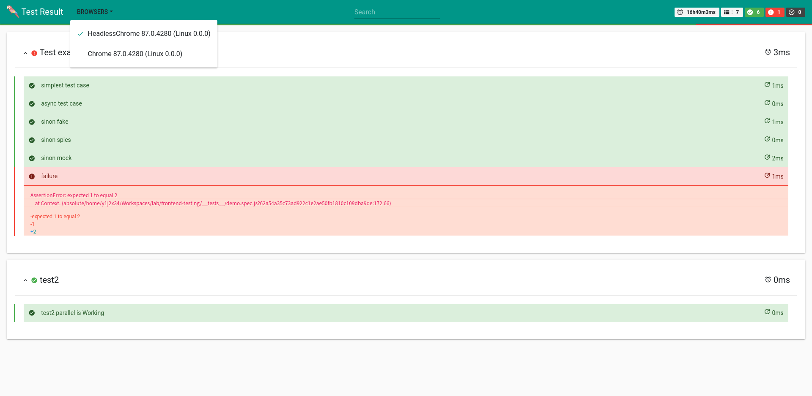

# `@jtex/karma-json2html`

This is a tool for converting the JSON report of karma results(generated by [`karma-structured-json-reporter`](https://www.npmjs.com/package/karma-structured-json-reporter) or [`@jtex/karma-plugin`](https://www.npmjs.com/package/@jtex/karma-plugin)) to HTML report.



## Usage

### convertion API

```ts
import { html } from '@jtex/karma-json2html';
import fs from 'fs';

const jsonReportData = {
    summary: {
        // ...
    },
    browsers: {
        // ...
    }
};
const options = {
    reportTitle: 'jtex html report title',
    focusOnFailures: true,
    collapsed: true,
    logoFile: '/path/to/logo.png',
    data: jsonReportData
};

const htmlContent = html(options);

fs.writeFile('/path/to/jtex-report.html', htmlContent);
```

### Integration into karmajs

Refer to [`@jtex/karma-plugin`](https://www.npmjs.com/package/@jtex/karma-plugin).
