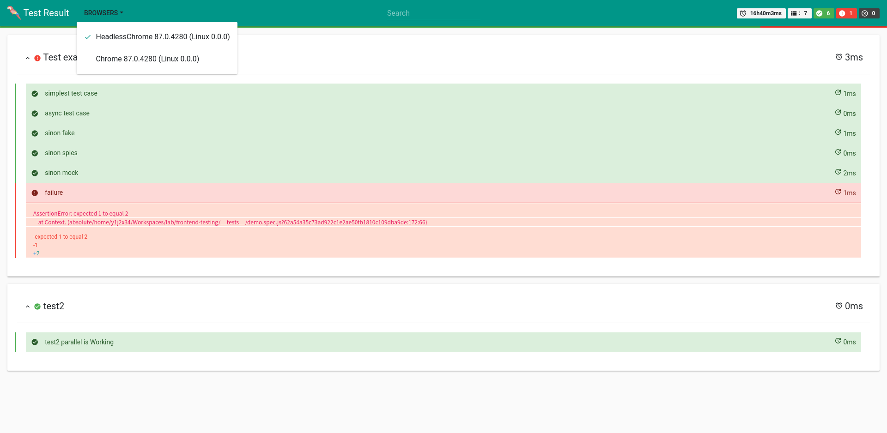

# </img>@jtex/karma-plugin

A karmajs plugin that includes all the testing tools created by `@jtex`.

## Installation

Install `@jtex/karma-plugin` into your project:

- via `npm`:

    ```bash
    npm i -D @jtex/karma-plugin
    ```

- via `yarn`

    ```bash
    yarn add -D @jtex/karma-plugin
    ```

## Usage

## Basic configuration

In you `karma.conf.js` add `@jtex/karma-plugin` to your plugins.

```js
// karma.conf.js
module.exports = function(config) {
    config.set({
        plugin: [
            '@jtex/karma-plugin'
        ]
    })
}
```

## Reporters

### `jtex-json` reporter

`jtex-json` reporter Generates a JSOn report of the karma results.
The results are very similar to the internal karma result objects. See below:

```json
{
    "summary": {
        "success": 6,
        "failed": 1,
        "skipped": 0,
        "error": false,
        "disconnected": false,
        "exitCode": 1
    },
    "browsers": [
        {
            "browser": {
                "id": "82275798",
                "fullName": "Mozilla/5.0 (X11; Linux x86_64) AppleWebKit/537.36 (KHTML, like Gecko) HeadlessChrome/87.0.4280.88 Safari/537.36",
                "name": "HeadlessChrome 87.0.4280 (Linux 0.0.0)",
                "state": "DISCONNECTED",
                "lastResult": {
                    "startTime": 1611677505999,
                    "total": 7,
                    "success": 6,
                    "failed": 1,
                    "skipped": 0,
                    "totalTime": 60000003,
                    "netTime": 3,
                    "error": false,
                    "disconnected": false
                },
                "disconnectsCount": 0,
                "noActivityTimeout": 30000,
                "disconnectDelay": 2000
            },
            "errors": [],
            "results": [
                {
                    "id": "",
                    "description": "simplest test case",
                    "suite": [
                        "Test example"
                    ],
                    "success": true,
                    "skipped": false,
                    "pending": false,
                    "time": 0,
                    "log": [],
                    "assertionErrors": [],
                    "startTime": 1611677505991,
                    "endTime": 1611677505992
                }
            ]
        }
    ]
}

```

#### Configuration

```js
{
    // ...
    reporters: [
        'jtex-json',
        // ...
    ],
    jtexReporter: {
        json: {
            output: 'path/to/json-report-file.json'
        }
    }
}
```

### `jtex-html` reporter

`jtex-html` reporter generates a HTML report of the karma results.



See also <https://npmjs.com/package/@jtex/karma-json2html>

#### Configuration

```js
{
    // ...
    reporters: [
        'jtex-html',
        // ...
    ],
    jtexReporter: {
        html: {
            reportTitle: 'jtex html report title',
            focusOnFailures: true,
            collapsed: true,
            logoFile: '/path/to/logo.png',
        }
    }
}
```

## More

More features are still under development.
